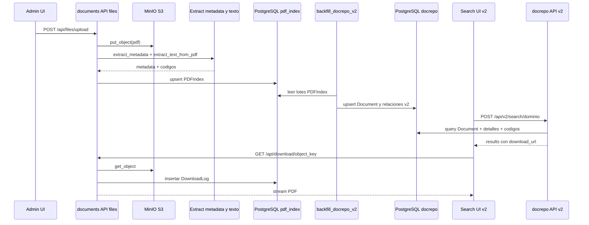

# Manejo de archivos - flujo actual y base para siguiente fase

## Contexto
El manejo de archivos esta actualmente en un estado hibrido.

- Implementado (legacy): carga, extraccion, indexacion y descarga principal via documents.views.
- Implementado (v2): consulta documental via docrepo.views y modelo docrepo_*.
- En transicion: persistencia y trazabilidad completas aun dependen parcialmente de tablas legacy.

## Flujo implementado hoy (end-to-end)

1. Carga de archivos
- Endpoint: /api/files/upload.
- Se recibe multipart, se valida extension PDF y se guarda en MinIO con put_object.

2. Extraccion de metadata y contenido
- Se ejecuta extract_metadata(path) para derivar razon social, banco, mes, anio y tipo documental desde la ruta/nombre.
- Se ejecuta extract_text_from_pdf() para extraer texto y codigos de empleado.

3. Indexacion primaria
- Se crea o actualiza PDFIndex con metadata, codigos y estado de indexacion.
- SyncIndexView y ReindexView mantienen coherencia frente a cambios en MinIO.

4. Migracion a arquitectura v2
- backfill_docrepo_v2 toma PDFIndex como origen.
- Se pueblan tablas v2: Document, StorageObject, IndexState, EmployeeCode y tabla detalle por dominio.

5. Consulta
- Frontend v2 consulta /api/v2/search/seguros, /api/v2/search/tregistro o /api/v2/search/constancias.
- BaseV2SearchView responde desde docrepo_* y puede comparar contra legacy (dual-read opcional).

6. Descarga
- La descarga final hoy sigue por /api/download/<object_key>.
- El archivo se obtiene de MinIO y se registra DownloadLog.

## Diagrama de secuencia del manejo de archivos

## Persistencia en storage

### Implementado
- MinIO/S3 conserva el binario del PDF.
- docrepo_storage_object guarda metadatos de objeto:
  - bucket_name
  - object_key
  - etag
  - size_bytes
  - checksum_sha256 (opcional)

### En transicion
- La API de descarga aun usa el endpoint legacy y no una ruta nativa de docrepo.

## Impacto en busqueda y backend

### Mejoras implementadas
- Busqueda por dominio con joins tipados en vez de depender solo de texto plano.
- EmployeeCode permite filtros por codigo con estructura relacional dedicada.
- IndexState permite separar estado de indexacion y errores de la entidad Document.

### Limitaciones vigentes
- Los filtros de UI siguen viniendo de PDFIndex (/api/filter-options).
- El flujo de carga/indexacion no escribe directamente en docrepo.

## Trazabilidad y auditoria

### Implementado
- DownloadLog registra descargas de archivos.
- AuditLoggingMiddleware registra eventos de escritura en logger (method, path, status, ip, user).

### En transicion
- Existe tabla audit_event (auditlog app), pero no hay insercion activa desde middleware a esa tabla.

## Deuda tecnica y siguiente fase

### Pendientes detectados
- Migrar carga e indexacion para escribir en docrepo como fuente primaria.
- Exponer endpoint de descarga nativo v2 desacoplado del endpoint legacy.
- Unificar filtros de UI sobre catalogos/docrepo para eliminar dependencia de PDFIndex.
- Persistir auditoria estructurada en audit_event.

### Riesgos
- Inconsistencias entre resultado v2 y legacy durante la transicion si no se monitorea parity.
- Mayor complejidad operativa por doble fuente funcional (legacy + v2).
- Regresiones de permisos/autenticacion por coexistencia de multiples rutas auth.

### Decisiones aun abiertas
- Momento de corte para desactivar /api/search y /api/files/* legacy.
- Estrategia final de indexacion: online en subida, asyncrona por cola, o mixta.
- Modelo de versionado de indices (index_version) para futuros cambios de extraccion.

### Recomendaciones para siguiente iteracion
1. Implementar ingest v2 directa: upload -> metadata -> docrepo (sin paso obligatorio por PDFIndex).
2. Publicar API de descarga v2 con validaciones por Document.id y object_key.
3. Mover /api/filter-options a consultas sobre catalog_* y docrepo_*.
4. Conectar AuditLoggingMiddleware con audit_event usando correlation_id por request.
5. Automatizar validacion de paridad por dominio en pipeline de despliegue.
