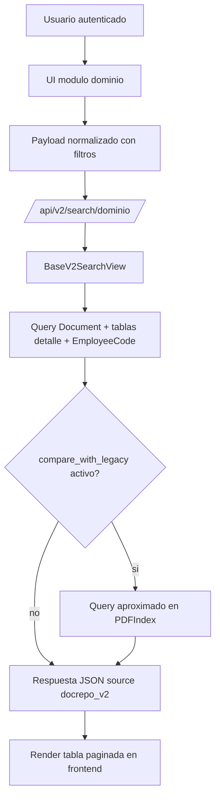

# Arquitectura modular - Modulos, dependencias y acoplamientos

## Mapa de modulos principales

| Modulo/app | Responsabilidad principal | Dependencias directas |
| --- | --- | --- |
| core | Utilidades de dominio compartidas (TimestampedModel) | django.db |
| catalogs | Catalogos normalizados de referencia | core |
| docrepo | Modelo documental v2, busqueda v2 y comandos de migracion | core, catalogs, documents.PDFIndex (solo transicion) |
| auditlog | Eventos de auditoria persistente orientados a dominio | core, docrepo, AUTH_USER_MODEL |
| documents | Flujo legacy de busqueda, indexacion, descarga y gestion de archivos; middleware de seguridad | MinIO, PDFIndex, DownloadLog, DRF |
| pdf_search_project/settings | Seleccion de entorno y feature flags de transicion | dotenv, settings/base.py |
| templates/js v2 | UI por modulo y consumo de auth + search v2 | /api/auth/*, /api/me, /api/v2/search/*, /api/download/* |

## Dependencias funcionales entre modulos

- docrepo depende de catalogs para clasificar documentos por dominio, empresa, periodo y estado.
- docrepo depende de documents.PDFIndex solo para migracion y comparacion legacy (no para el modelo v2).
- auditlog referencia docrepo.Document, pero el middleware actual en documents aun registra auditoria por logger y no persiste AuditEvent.
- la UI v2 mezcla endpoints nuevos y legacy:
  - busqueda principal por /api/v2/search/*.
  - descarga por /api/download/* (legacy).
  - filtros globales por /api/filter-options (legacy sobre PDFIndex).

## Flujo de busqueda documental con el nuevo diseno

## Puntos de acoplamiento actuales

1. Descarga de archivos
- Estado: En transicion.
- Detalle: La respuesta v2 retorna download_url hacia /api/download/<object_key> en documents.views.

2. Filtros de UI
- Estado: En transicion.
- Detalle: Los selectores de filtros se cargan desde /api/filter-options basado en PDFIndex.

3. Auditoria de operaciones
- Estado: En transicion.
- Detalle: Existe auditlog.AuditEvent, pero AuditLoggingMiddleware registra en logger y no inserta en audit_event.

4. Configuracion de settings
- Estado: Implementado con riesgo operativo menor.
- Detalle: El import real usa el paquete pdf_search_project/settings/__init__.py (selector por DJANGO_ENV), mientras el archivo pdf_search_project/settings.py permanece en el repo.

## Zonas con mejor escalabilidad

- Separacion por dominio documental:
  - TRegistroDocument
  - InsuranceDocument
  - ConstanciaAbonoDocument

- Catalogos centralizados:
  - Evitan repetir strings libres en banco, tipo, subtipo, periodo y estado.
  - Facilitan validacion y futuros paneles administrativos.

- BaseV2SearchView reutilizable:
  - Normaliza parseo y filtros comunes.
  - Permite agregar nuevos dominios con menor duplicacion.

- Comandos operativos para migracion controlada:
  - backfill_docrepo_v2 para traslado incremental.
  - validate_docrepo_parity para medir diferencias por scope.
