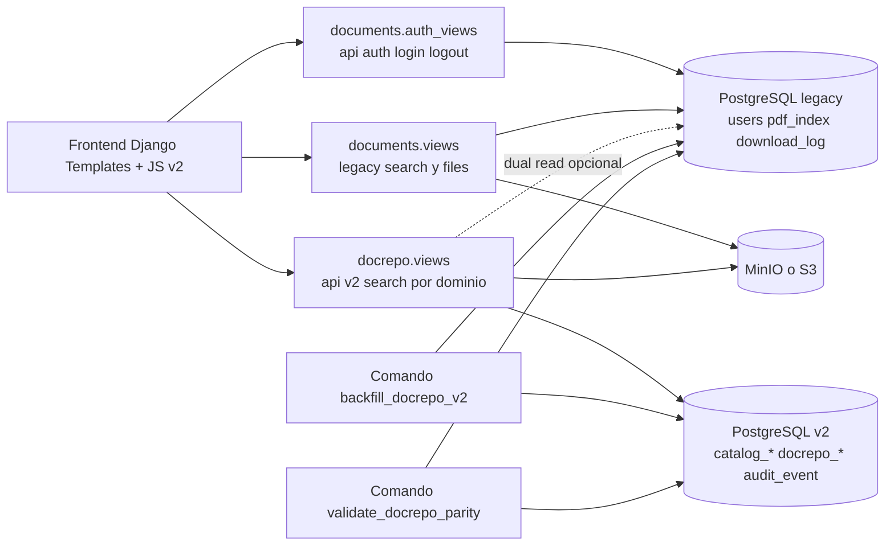

# Arquitectura V2 - Overview

## Alcance del documento
Este documento describe el estado real del codigo actual en la rama de trabajo, con foco en la nueva arquitectura modular y en la convivencia con el flujo legacy.

Regla de lectura usada en esta documentacion:
- Implementado: comportamiento visible en codigo y rutas activas.
- En transicion: comportamiento activo pero dependiente de componentes legacy.
- Propuesto: idea para iteracion futura, no activa aun.

## Resumen ejecutivo

### Que cambio
- Se introdujo un modelo de dominio nuevo con apps separadas: core, catalogs, docrepo y auditlog.
- Se agrego una capa de busqueda v2 por dominio en /api/v2/search/seguros, /api/v2/search/tregistro y /api/v2/search/constancias.
- La UI paso a un esquema por modulos (login, seguros, t-registro, constancias) y scripts JS separados por pantalla.
- Se agregaron comandos de migracion y validacion de paridad para mover datos desde pdf_index (legacy) hacia docrepo (v2).

### Por que se cambio
- El modelo legacy PDFIndex concentra demasiadas responsabilidades (metadata, indexacion y consulta) en una sola tabla.
- Era necesario desacoplar reglas por tipo documental para soportar crecimiento funcional y nuevas consultas.
- Se requeria una ruta de migracion controlada sin romper operaciones existentes.

### Beneficio tecnico
- Mejor separacion de responsabilidades por modulo y por dominio documental.
- Mejor base para evolucionar busquedas por metadatos tipados y no solo por texto/plano.
- Camino de transicion con dual-read opcional y validacion de paridad antes de un corte definitivo.

## Estado real de implementacion

| Area | Estado | Evidencia en codigo |
| --- | --- | --- |
| Modelo modular v2 (catalogs + docrepo) | Implementado | Nuevas apps y migraciones iniciales |
| Endpoints v2 de busqueda por dominio | Implementado | Rutas en docrepo/urls.py incluidas en /api/v2/ |
| Comandos de backfill y parity check | Implementado | backfill_docrepo_v2 y validate_docrepo_parity |
| Login UI + JWT en frontend de modulos | Implementado | login.html + login_v2.js + auth_views.py |
| Carga e indexacion primaria de archivos | En transicion | Sigue en documents/views.py y PDFIndex |
| Auditoria persistente en audit_event | En transicion | Modelo creado, middleware aun registra por logger |
| Eliminacion total del flujo legacy | Propuesto | Aun existe /api/search, /api/files/* y /api/download |

## Arquitectura de alto nivel

## Modulos cambiados detectados

| Modulo | Tipo de cambio | Resultado |
| --- | --- | --- |
| core | Nuevo | Base comun TimestampedModel |
| catalogs | Nuevo | Catalogos normalizados para dominio, empresa, periodo, estado y tipos |
| docrepo | Nuevo | Modelo documental v2 + API v2 + comandos de migracion/paridad |
| auditlog | Nuevo | Estructura de auditoria persistente |
| documents | Modificado | Sigue cubriendo flujo legacy, agrega login/logout API y vistas UI nuevas |
| pdf_search_project/settings | Modificado | Feature flags v2 y configuracion por entorno |
| pdf_search_project/urls.py | Modificado | Inclusion de /api/v2 |
| docker-compose.yaml | Modificado | Lectura de .env y control de DJANGO_ENV para django-app |

## Decisiones tecnicas reflejadas en codigo
- Modelo v2 por composicion: Document como agregado principal y tablas de detalle por dominio.
- Catalogos tipados para disminuir valores libres repetidos en campos de texto.
- API v2 con clases por dominio sobre una base comun (BaseV2SearchView).
- Estrategia de migracion incremental: backfill desde PDFIndex y dual-read opcional para comparar resultados.
- UI desacoplada por modulo y autenticacion JWT manejada desde frontend.
