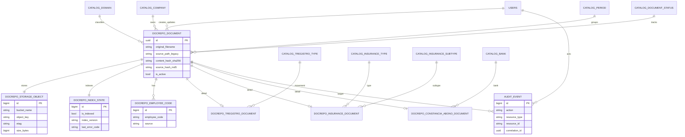

# Refactor summary - arquitectura modular y resultados observables

## Objetivo de esta bitacora
Registrar que quedo implementado en el rediseño ya aplicado, que sigue en transicion, y que se propone para la siguiente etapa.

## Resultado del rediseño por eje

| Eje | Estado | Resultado observable |
| --- | --- | --- |
| Modelo de datos modular | Implementado | Nuevas tablas catalog_* y docrepo_* con migraciones iniciales |
| API de busqueda por dominio | Implementado | Endpoints /api/v2/search/seguros, /tregistro, /constancias |
| Migracion de datos desde legacy | Implementado | Comando backfill_docrepo_v2 |
| Medicion de equivalencia legacy vs v2 | Implementado | Comando validate_docrepo_parity |
| Dual-read controlado por feature flag | Implementado | DOCREPO_DUAL_READ_ENABLED + compare_with_legacy |
| Login UI integrado con JWT | Implementado | /ui/login + /api/auth/login + /api/auth/logout |
| Auditoria persistente de dominio | En transicion | Modelo audit_event existe, middleware aun usa logger |
| Corte definitivo de capa legacy | Propuesto | /api/search y /api/files/* siguen activos |

## Base de datos y metadatos (nuevo modelo)

### Como quedo el modelo
- Entidad central: docrepo_document.
- Entidades de detalle por tipo documental:
  - docrepo_tregistro_document
  - docrepo_insurance_document
  - docrepo_constancia_abono_document
- Entidades de soporte:
  - docrepo_storage_object
  - docrepo_index_state
  - docrepo_employee_code
- Catalogos normalizados:
  - catalog_domain
  - catalog_company
  - catalog_period
  - catalog_document_status
  - catalog_bank
  - catalog_tregistro_type
  - catalog_insurance_type
  - catalog_insurance_subtype

### Relacion entre tipos documentales y metadatos
- Todo documento comparte metadata base (dominio, empresa, periodo, hashes, estado).
- Cada dominio agrega metadata especializada en su tabla de detalle.
- EmployeeCode desacopla codigos de empleado del campo CSV legacy y habilita filtrado relacional.

### Impacto en busqueda y backend
- Menor dependencia de parsing de strings para consultas de negocio.
- Mayor capacidad para agregar campos de dominio sin inflar una sola tabla global.
- Mejor control de integridad por constraints e indices especificos.

## Diagrama ER de la arquitectura v2

## Modulos que cambiaron y estaban sin documentar

1. Apps nuevas sin documento tecnico dedicado previo
- core
- catalogs
- docrepo
- auditlog

2. Flujos en transicion sin bitacora tecnica consolidada
- dual-read v2 vs legacy
- backfill y parity
- dependencia de descarga/filtros en capa legacy

3. UI v2 sin detalle de arquitectura operativa
- login + manejo de token
- pagina constancias
- scripts por modulo (seguros, tregistro, constancias)

Este archivo y los documentos en docs/architecture cubren esos vacios.
